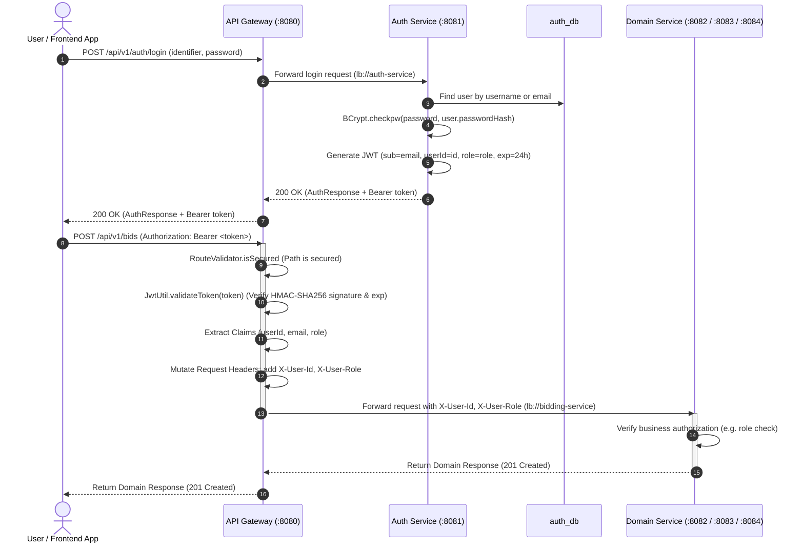
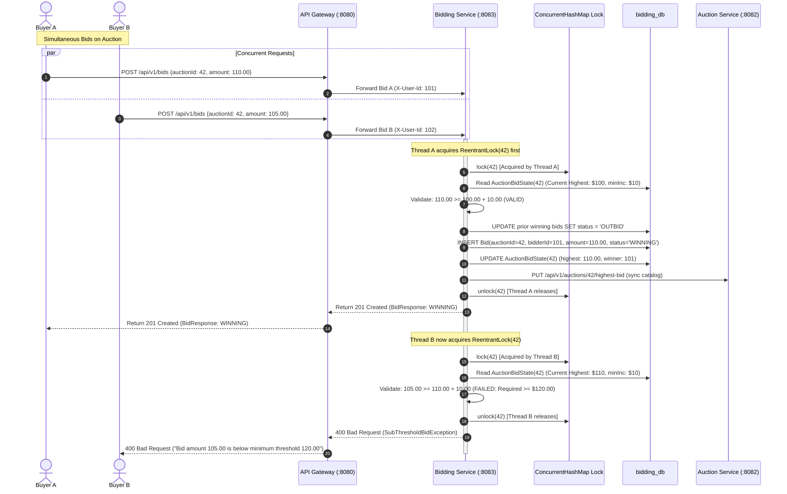
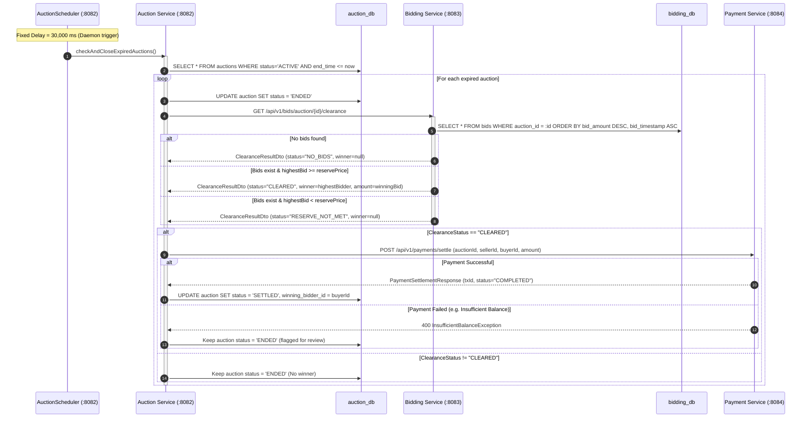
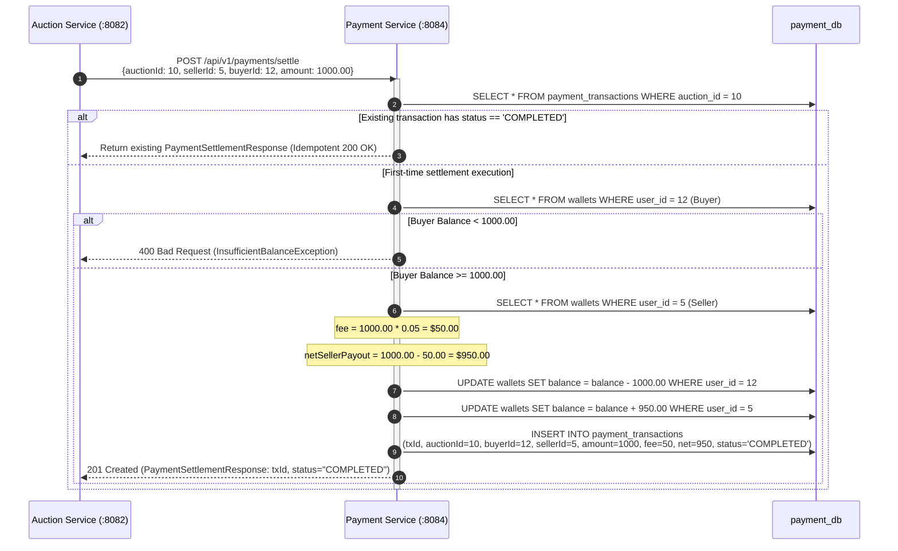

# PS025: Real-Time Distributed Bidding & Auction Clearance Engine
## Phase 2 — Microservice Identification and Distributed Architecture

---

## 1. High-Level Architecture Overview

PS025 is engineered as a cloud-native, distributed microservices platform designed for high-concurrency real-time bidding, deterministic clearance, and automated escrow payment settlement. The architecture enforces **Domain-Driven Design (DDD)** bounded contexts, strict **Database-per-Service** isolation, and declarative inter-service communication via **Spring Cloud Netflix Eureka** and **OpenFeign**.

### 1.1 ASCII System Topology

```
                                  +---------------------------------------+
                                  |             Eureka Server             |
                                  |              (Port 8761)              |
                                  |    Service Registry & Discovery       |
                                  +-------------------+-------------------+
                                                      ^
                                                      | Dynamic Heartbeat & Lookup
            +-----------------------------------------+-----------------------------------------+
            |                                         |                                         |
            v                                         v                                         v
+-----------------------+                 +-----------------------+                 +-----------------------+
|      API Gateway      |                 |     Auth Service      |                 |    Auction Service    |
|      (Port 8080)      |                 |      (Port 8081)      |                 |      (Port 8082)      |
| [Spring Cloud Gateway]|                 | [JWT / BCrypt / RBAC] |                 |  [Catalog & Scheduler] |
| [AuthFilter & Router] |                 +-----------+-----------+                 +-----------+-----------+
+-----------+-----------+                             |                                         |
            |                                         v                                         | (OpenFeign)
            | (Load Balanced Routing)            [ auth_db ]                                    | lb://payment-service
            +-----------------------------------------+                                         v
            |                                         |                             +-----------------------+
            v                                         v                             |    Payment Service    |
+-----------------------+                 +-----------------------+                 |      (Port 8084)      |
|    Bidding Service    | <===(OpenFeign)=|    Auction Service    |                 |  [Escrow & Settlement]|
|      (Port 8083)      |  lb://bidding-  |      (Port 8082)      |                 +-----------+-----------+
| [ReentrantLock / Engine]     service    +-----------+-----------+                             |
+-----------+-----------+                             |                                         v
            |                                         v                                    [ payment_db ]
            v                                    [ auction_db ]
       [ bidding_db ]
```

---

### 1.2 High-Level Mermaid Component Architecture

```mermaid
flowchart TD
    subgraph Clients["Client Layer"]
        WebClient["Web Browser / SPA"]
        MobileApp["Mobile Application"]
        AdminConsole["Admin Dashboard"]
    end

    subgraph EdgeLayer["Edge / Ingress Layer"]
        Gateway["Spring Cloud API Gateway (Port 8080)<br/>- Route Predicates<br/>- Global CORS Filter<br/>- AuthenticationFilter (JWT Validation)<br/>- Header Enrichment (X-User-Id, X-User-Role)"]
    end

    subgraph DiscoveryLayer["Service Discovery Layer"]
        Eureka["Eureka Discovery Server (Port 8761)<br/>- Instance Registry<br/>- Heartbeat Monitoring<br/>- Self-Preservation Mode"]
    end

    subgraph Microservices["Independently Deployable Microservices"]
        AuthSvc["Auth Service (Port 8081)<br/>- Registration & Login<br/>- BCrypt Password Hashing<br/>- JWT Creation & Validation"]
        AuctionSvc["Auction Service (Port 8082)<br/>- Auction Lifecycle Management<br/>- Catalog Search & Filters<br/>- Expiry Scheduler (every 30s)<br/>- Clearance Orchestrator"]
        BiddingSvc["Bidding Service (Port 8083)<br/>- High-Concurrency In-Memory Locking<br/>- Sub-Threshold Bid Rejection<br/>- Price-Time Priority Clearance<br/>- Bid History Journal"]
        PaymentSvc["Payment Service (Port 8084)<br/>- Digital Wallets & Deposits<br/>- 5% Platform Fee Calculation<br/>- Atomic Escrow Settlement<br/>- Idempotent Transaction Ledger"]
    end

    subgraph DataLayer["Isolated Database Layer (MySQL)"]
        AuthDB[("auth_db<br/>(users, roles)")]
        AuctionDB[("auction_db<br/>(auctions)")]
        BiddingDB[("bidding_db<br/>(bids, auction_bid_states)")]
        PaymentDB[("payment_db<br/>(wallets, transactions)")]
    end

    %% Client Ingress
    WebClient -->|HTTPS /api/v1/**| Gateway
    MobileApp -->|HTTPS /api/v1/**| Gateway
    AdminConsole -->|HTTPS /api/v1/**| Gateway

    %% Discovery Heartbeats
    Gateway -.->|Heartbeat / Registry| Eureka
    AuthSvc -.->|Register / Heartbeat| Eureka
    AuctionSvc -.->|Register / Heartbeat| Eureka
    BiddingSvc -.->|Register / Heartbeat| Eureka
    PaymentSvc -.->|Register / Heartbeat| Eureka

    %% Gateway Routing
    Gateway -->|lb://auth-service| AuthSvc
    Gateway -->|lb://auction-service| AuctionSvc
    Gateway -->|lb://bidding-service| BiddingSvc
    Gateway -->|lb://payment-service| PaymentSvc

    %% Inter-Service Feign Calls
    AuctionSvc -->|OpenFeign: calculateClearance()| BiddingSvc
    AuctionSvc -->|OpenFeign: processSettlement()| PaymentSvc
    BiddingSvc -->|OpenFeign: getAuctionById(), updateHighestBid()| AuctionSvc

    %% Database Isolation
    AuthSvc --> AuthDB
    AuctionSvc --> AuctionDB
    BiddingSvc --> BiddingDB
    PaymentSvc --> PaymentDB
```

---

## 2. Service Responsibility Table

| Microservice | Port | Database Schema | Primary Domain Responsibilities | Non-Responsibilities |
|---|:---:|:---:|---|---|
| **Eureka Server** | `8761` | *None* | Centralized registry for all microservice instances; cluster heartbeat monitoring; peer discovery; registry caching. | Does not process business traffic, routing, or authentication. |
| **API Gateway** | `8080` | *None* | Single public entry point; dynamic route resolution (`lb://<service>`); JWT token extraction and cryptographic signature validation; claims extraction and header injection (`X-User-Id`, `X-User-Email`, `X-User-Role`); CORS handling. | Does not contain business logic, database connections, or password hashing. |
| **Auth Service** | `8081` | `auth_db` | User identity lifecycle (registration, login); BCrypt password encryption; JWT token generation (`HS256`); token claims validation; role assignment (`BUYER`, `SELLER`, `ADMIN`). | Does not manage auctions, bids, or wallet balances. |
| **Auction Service** | `8082` | `auction_db` | Catalog management; auction creation and status transitions (`DRAFT`, `ACTIVE`, `ENDED`, `SETTLED`, `CANCELLED`); ownership verification; scheduled expired auction polling (`AuctionScheduler`); clearance orchestration. | Does not handle high-concurrency raw bid ingestion or wallet transfers. |
| **Bidding Service** | `8083` | `bidding_db` | High-concurrency bid placement; per-auction in-memory locking (`ReentrantLock`); sub-threshold bid rejection; anti-shill verification; bid status tracking (`WINNING`, `OUTBID`); deterministic price-time clearance calculation. | Does not manage user credentials, catalog browsing, or financial transfers. |
| **Payment Service** | `8084` | `payment_db` | Internal digital wallet balances; wallet deposits; 5% platform monetization fee calculation; atomic wallet debits and credits; idempotent settlement ledger journal (`PaymentTransaction`). | Does not validate bid amounts or maintain auction timers. |

---

## 3. Service Boundaries & Domain Ownership

### 3.1 Domain-Driven Bounded Contexts
1. **Identity & Access Management (IAM)**: Encapsulated wholly within `auth-service`. Owns user authentication state, credential hashes, and JWT key pairs.
2. **Auction Lifecycle & Catalog Context**: Encapsulated within `auction-service`. Owns auction lifecycle state, descriptions, reserve prices, and expiration schedules.
3. **High-Velocity Bidding Context**: Encapsulated within `bidding-service`. Optimized specifically for write-heavy, sub-millisecond bid execution and clearance calculation.
4. **Escrow Settlement & Ledger Context**: Encapsulated within `payment-service`. Operates as an immutable financial ledger with double-entry style wallet mutations.

### 3.2 Database Ownership Invariant
- **Strict Database-per-Service**: Each microservice connects exclusively to its own dedicated MySQL database schema.
- **No Cross-Database Foreign Keys**: References across services are maintained solely via logical primary keys (e.g., `Long auctionId`, `Long userId`).
- **No Shared Tables**: Under no circumstances does any service query or write to another service's database directly.

---

## 4. API Boundaries & Endpoint Specifications

### 4.1 Auth Service (`/api/v1/auth`)

| HTTP Method | Endpoint | Description | Request Payload | Response Body | Auth Required |
|---|---|---|---|---|:---:|
| `POST` | `/api/v1/auth/register` | Register a new user account | `RegisterRequest` | `AuthResponse` (token, user info) | No |
| `POST` | `/api/v1/auth/login` | Authenticate using username or email | `LoginRequest` | `AuthResponse` (token, user info) | No |
| `GET` | `/api/v1/auth/validate` | Verify JWT token validity | Header or Query Param | `ValidateTokenResponse` (valid, claims) | Optional |

### 4.2 Auction Service (`/api/v1/auctions`)

| HTTP Method | Endpoint | Description | Request Payload | Response Body | Auth Required |
|---|---|---|---|---|:---:|
| `POST` | `/api/v1/auctions` | Create new auction listing | `CreateAuctionRequest` | `AuctionResponse` | Yes (`SELLER`, `ADMIN`) |
| `GET` | `/api/v1/auctions/{id}` | Get auction details by ID | *None* | `AuctionResponse` | No |
| `GET` | `/api/v1/auctions` | Query auctions by status and category | Query params | `List<AuctionResponse>` | No |
| `GET` | `/api/v1/auctions/seller/{sellerId}` | Query auctions by seller ID | *None* | `List<AuctionResponse>` | Yes |
| `PUT` | `/api/v1/auctions/{id}` | Update auction metadata | `UpdateAuctionRequest` | `AuctionResponse` | Yes (Owner, Admin) |
| `POST` | `/api/v1/auctions/{id}/activate` | Transition `DRAFT` to `ACTIVE` | *None* | `AuctionResponse` | Yes (Owner, Admin) |
| `POST` | `/api/v1/auctions/{id}/cancel` | Cancel an active auction | *None* | `AuctionResponse` | Yes (Owner, Admin) |
| `PUT` | `/api/v1/auctions/{id}/highest-bid` | Inter-service sync of highest bid | `UpdateHighestBidRequest` | `AuctionResponse` | Internal (Bidding) |
| `POST` | `/api/v1/auctions/{id}/clear` | Manually close and clear auction | *None* | `ClearanceResultDto` | Yes (`ADMIN`) |

### 4.3 Bidding Service (`/api/v1/bids`)

| HTTP Method | Endpoint | Description | Request Payload | Response Body | Auth Required |
|---|---|---|---|---|:---:|
| `POST` | `/api/v1/bids` | Place real-time atomic bid | `PlaceBidRequest` | `BidResponse` | Yes (`BUYER`) |
| `GET` | `/api/v1/bids/auction/{auctionId}` | List all bids for an auction | *None* | `List<BidResponse>` | Yes |
| `GET` | `/api/v1/bids/auction/{auctionId}/highest` | Get current winning bid | *None* | `BidResponse` | No |
| `GET` | `/api/v1/bids/auction/{auctionId}/clearance` | Compute deterministic clearance | *None* | `ClearanceResultDto` | Internal (Auction) |

### 4.4 Payment Service (`/api/v1/payments`)

| HTTP Method | Endpoint | Description | Request Payload | Response Body | Auth Required |
|---|---|---|---|---|:---:|
| `POST` | `/api/v1/payments/wallet/deposit` | Add funds to user wallet | `WalletDepositRequest` | `WalletResponse` | Yes |
| `GET` | `/api/v1/payments/wallet` | Get authenticated user wallet | *None* | `WalletResponse` | Yes |
| `GET` | `/api/v1/payments/wallet/{userId}` | Get user wallet by user ID | *None* | `WalletResponse` | Yes (`ADMIN`) |
| `POST` | `/api/v1/payments/settle` | Settle cleared auction payment | `PaymentSettlementRequest` | `PaymentSettlementResponse` | Internal (Auction) |
| `GET` | `/api/v1/payments/transactions/{txId}` | Get transaction details by ID | *None* | `TransactionResponse` | Yes |

---

## 5. Service-to-Service Communication Design

### 5.1 OpenFeign Declarative Clients
Inter-service calls occur over HTTP REST using Spring Cloud OpenFeign interfaces decorated with `@FeignClient`. Service instances are dynamically resolved from Eureka using logical service IDs:

```java
// Auction Service -> Bidding Service
@FeignClient(name = "bidding-service")
public interface BiddingClient {
    @GetMapping("/api/v1/bids/auction/{auctionId}/clearance")
    ClearanceResultDto calculateClearance(@PathVariable("auctionId") Long auctionId);
}

// Auction Service -> Payment Service
@FeignClient(name = "payment-service")
public interface PaymentClient {
    @PostMapping("/api/v1/payments/settle")
    PaymentSettlementResponse processSettlement(@RequestBody PaymentSettlementRequest request);
}

// Bidding Service -> Auction Service
@FeignClient(name = "auction-service")
public interface AuctionClient {
    @GetMapping("/api/v1/auctions/{id}")
    AuctionDto getAuctionById(@PathVariable("id") Long id);

    @PutMapping("/api/v1/auctions/{id}/highest-bid")
    AuctionDto updateHighestBid(@PathVariable("id") Long id, @RequestBody UpdateHighestBidRequest request);
}
```

### 5.2 Context Header Propagation
When requests traverse the API Gateway, the `AuthenticationFilter` enriches HTTP request headers before forwarding to downstream microservices:
- `X-User-Id`: Long integer primary key of the authenticated user.
- `X-User-Email`: Email address extracted from JWT subject claim.
- `X-User-Role`: Granted authority (`ROLE_BUYER`, `ROLE_SELLER`, `ROLE_ADMIN`).

Downstream controllers inject these parameters via `@RequestHeader(value = "X-User-Id", required = false)` to enforce business-level ownership and role rules.

---

## 6. End-to-End Architectural Flows

### 6.1 Authentication & Authorization Flow



---

### 6.2 Real-Time Concurrent Bid Processing Flow



---

### 6.3 Auction Closing & Deterministic Clearance Flow



---

### 6.4 Escrow Payment & Settlement Flow



---

## 7. Service Discovery & Registration (Eureka)

### 7.1 Registration Architecture
Eureka Server acts as a service directory with zero manual routing configuration:
1. **Dynamic Registration**: Every service boots with `spring.application.name` matching its registered Eureka service ID (`AUTH-SERVICE`, `AUCTION-SERVICE`, `BIDDING-SERVICE`, `PAYMENT-SERVICE`, `API-GATEWAY`).
2. **Heartbeat Monitoring**: Every 30 seconds, client instances emit heartbeats to Eureka (`http://localhost:8761/eureka/`).
3. **Lease Renewal & Eviction**: If Eureka misses 3 consecutive heartbeats (90 seconds), the instance is evicted from active discovery tables unless self-preservation is triggered.
4. **Prefer-IP-Address**: Configured with `eureka.instance.prefer-ip-address: true` to prevent DNS lookup failures inside virtual networks and container bridges.

---

## 8. API Gateway Routing & Load Balancing Strategy

### 8.1 Gateway Predicates & URI Scheme
Spring Cloud Gateway routes requests dynamically using the Eureka service directory via the `lb://` URI scheme:
- `Path=/api/v1/auth/**` $\to$ `lb://auth-service`
- `Path=/api/v1/auctions/**` $\to$ `lb://auction-service`
- `Path=/api/v1/bids/**` $\to$ `lb://bidding-service`
- `Path=/api/v1/payments/**` $\to$ `lb://payment-service`

### 8.2 Client-Side Load Balancing (Spring Cloud LoadBalancer)
When a service is scaled horizontally to $N$ instances (e.g., 3 instances of `bidding-service` on ports 8083, 8085, 8086):
1. The Gateway pulls the instance list from Eureka and caches it locally.
2. The **Spring Cloud LoadBalancer** algorithm routes incoming requests using **Round-Robin** or **Reactive Random** selection.
3. Health-check integrations automatically prune unhealthy or slow instances from the load-balancing rotation.

---

## 9. Failure Scenarios & Resilience Architecture

| Failure Scenario | Impact | System Reaction & Recovery Strategy |
|---|---|---|
| **Scenario 1: Bidding Service Down during Clearance** | Auction Service cannot fetch clearance result from `bidding-service`. | **Graceful Local Fallback**: In `AuctionServiceImpl.closeAndClearAuction()`, the Feign call is wrapped in a `try-catch`. If the Bidding Service is unreachable, the system triggers `CLEARED_LOCAL` fallback using locally cached `currentHighestBid` and `winningBidderId`. |
| **Scenario 2: Insufficient Buyer Funds during Settlement** | Buyer wallet does not hold enough balance to cover winning bid. | **Non-Settlement Retention**: `PaymentService` throws `InsufficientBalanceException`. `AuctionService` catches error and leaves auction in `ENDED` state (never `SETTLED`). Funds remain un-transferred; incident logged for second-chance bidding or relisting. |
| **Scenario 3: Payment Service Unavailable** | Auction cleared, but payment service fails to respond. | **Safe Transaction Isolation**: `AuctionService` catches connection exception and retains auction in `ENDED` state. The scheduled clearance daemon retries settlement on subsequent iterations without data loss. |
| **Scenario 4: High-Frequency Bid Race Collision** | Multiple buyers submit identical or incremented bids at the exact millisecond. | **Two-Tier Synchronization**: In-memory per-auction `ReentrantLock` serializes execution threads within a service replica. If cross-container replicas race, the database `@Version` column on `AuctionBidState` rejects the stale update with `OptimisticLockingFailureException`. |
| **Scenario 5: Duplicate Settlement Execution** | Network glitch causes duplicate `processSettlement()` calls. | **Idempotent Transaction Ledger**: `PaymentService` checks for existing completed transaction for `auctionId`. If found, it immediately returns the original completed transaction with zero double-deduction risk. |
| **Scenario 6: Eureka Server Outage** | Eureka Server goes offline or becomes partitioned. | **Client-Side Cache Resilience**: Microservices and the API Gateway maintain a local cache of service instance locations. The system continues routing traffic uninterrupted while Eureka restarts. |

---

## 10. Independent Deployability & Multi-Container Setup

To ensure zero coupling and autonomous DevOps lifecycle for each service:
1. **Isolated Build Units**: Every service possesses an independent `pom.xml` and can be built, packaged (`mvn clean package`), and tested (`mvn test`) independently of peer modules.
2. **Containerized Deployment**: Each service is bundled with an optimized multi-stage Docker container specification.
3. **Infrastructure Compose**: The entire distributed system is orchestratable via `docker-compose.yml`:
   - MySQL service (`3306`) with healthcheck
   - `eureka-server` (`8761`)
   - `api-gateway` (`8080`)
   - `auth-service` (`8081`)
   - `auction-service` (`8082`)
   - `bidding-service` (`8083`)
   - `payment-service` (`8084`)

---
*End of Phase 2 Architecture Specification.*
