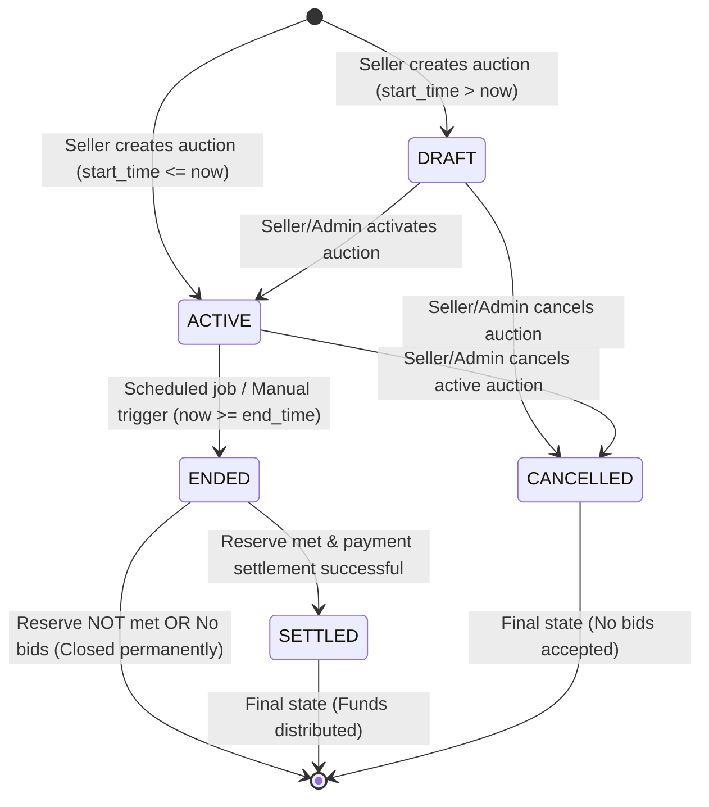
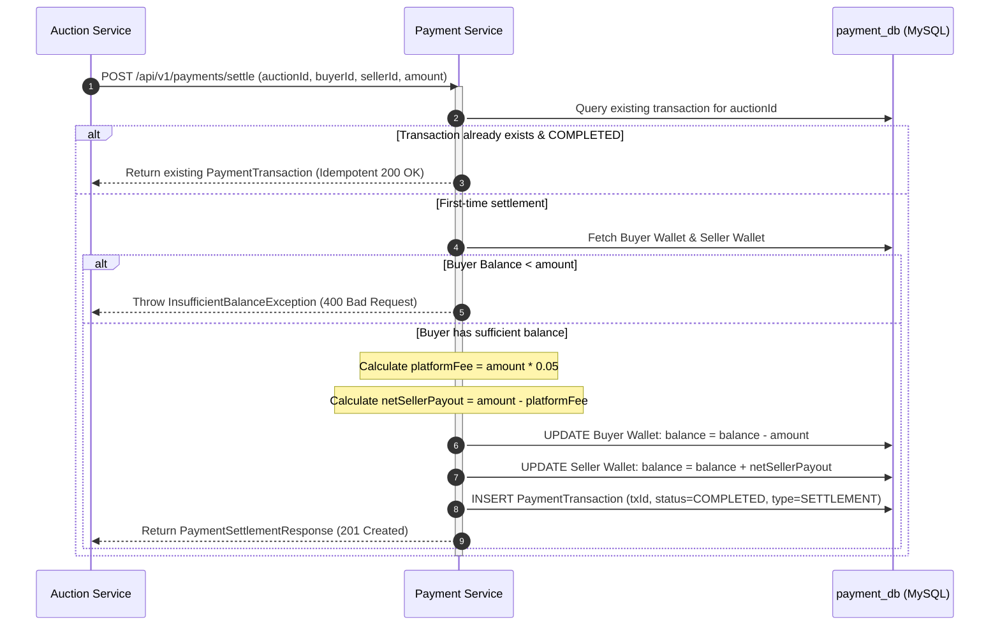

# PS025: Real-Time Distributed Bidding & Auction Clearance Engine
## Phase 1 — Problem Analysis and Requirement Specification

---

## 1. Problem Statement

Traditional monolithic auction and e-commerce bidding platforms suffer from severe structural bottlenecks when subjected to real-time, high-concurrency workloads. During high-profile auctions, the phenomenon known as **"bid sniping"** (rapid bursts of hundreds or thousands of competing bids submitted in the final seconds of an auction) causes conventional systems to experience:

1. **Race Conditions & Dirty Writes**: Concurrent database updates to a single auction record frequently result in lost updates, non-deterministic winning bids, and inconsistent auction states.
2. **Database Contention & Lock Serialization**: Monolithic architectures sharing a single database engine suffer from table/row lock contention, cascading latency spikes across unrelated services (e.g., catalog browsing, user authentication, and billing).
3. **Coupled Failures**: A failure or slowdown in payment processing, third-party wallet settlement, or heavy catalog queries directly impacts the millisecond-sensitive real-time bidding loop.
4. **Lack of Deterministic Winner Resolution**: Sub-millisecond ties between identical bid amounts or near-simultaneous bids are often resolved arbitrarily or incorrectly due to asynchronous clock skews and un-sequenced event queues.
5. **Security and Trust Deficits**: Shading, unauthorized seller bids (shill bidding), and sub-threshold bid flooding can undermine the integrity and regulatory compliance of an auction platform.

**PS025** solves these core distributed computing challenges by providing a **Real-Time Distributed Bidding & Auction Clearance Engine** built as an independently deployable, fault-tolerant microservices ecosystem. It decouples high-throughput bidding contention from auction lifecycle management, catalog discovery, and financial settlement through fine-grained concurrency control, strict database isolation, and deterministic mathematical clearance rules.

---

## 2. Business Use Case

PS025 is engineered as an enterprise-grade digital auction clearance platform catering to high-value, time-sensitive assets such as:
- Rare physical and digital collectibles, art, and memorabilia
- Excess commercial inventory and wholesale liquidation
- Time-bounded infrastructure allocations (e.g., ad impressions, compute spot instances)
- High-stakes real estate and automotive auctions

### Core Value Drivers:
- **Fair and Transparent Market Pricing**: Strict mathematical rules enforce transparent English auctions where every participant operates under identical deterministic bidding rules.
- **Guaranteed Settlement & Zero Bad Debt**: Automated escrow workflows verify buyer solvency and instantly lock/transfer funds upon auction closure, eliminating buyer default risks for sellers.
- **Monetization Model**: An automated platform fee (5.00% by default) is computed and deducted during clearance settlement, providing a risk-free, transparent revenue stream.
- **Auditability and Dispute Resolution**: Every bid placement, status transition (`ACTIVE`, `OUTBID`, `WINNING`, `REJECTED`), and wallet balance mutation is immutably journaled with microsecond timestamps.

---

## 3. Functional Requirements (FR)

| Requirement ID | Module / Area | Description |
|---|---|---|
| **FR-01** | User Identity & RBAC | The system shall support user registration, credential authentication, and Role-Based Access Control (`BUYER`, `SELLER`, `ADMIN`). |
| **FR-02** | Dual-Identifier Login | Users shall be able to authenticate using either their registered `username` or `email` address alongside a salted, hashed password. |
| **FR-03** | Stateless Token Management | The system shall generate cryptographically signed JWT tokens carrying user identities, roles, and validity periods for downstream authorization. |
| **FR-04** | Auction Creation | Verified sellers shall be able to create auctions with a title, description, category, starting price, reserve price, minimum bid increment, and start/end timestamps. |
| **FR-05** | Auction State Transitions | The system shall manage explicit lifecycle transitions: `DRAFT` $\to$ `ACTIVE` $\to$ `ENDED` $\to$ `SETTLED` (or `CANCELLED`). |
| **FR-06** | Real-Time Bid Placement | Authenticated buyers shall submit bids specifying `auctionId` and `bidAmount`. |
| **FR-07** | Sub-Threshold Rejection | The engine shall immediately reject any bid where `bidAmount < currentHighestBid + minBidIncrement` (or `bidAmount < startingPrice` for the initial bid). |
| **FR-08** | Anti-Shill Bidding | The engine shall strictly prevent a seller from placing bids on auctions they created (`bidderId == sellerId`). |
| **FR-09** | Outbid Status Tracking | Upon acceptance of a new highest bid, all previously `WINNING` bids for that auction shall transition atomically to `OUTBID`. |
| **FR-10** | Deterministic Clearance | Upon auction expiration, the system shall evaluate all submitted bids and deterministically calculate the clearance result using price-time priority. |
| **FR-11** | Reserve Price Enforcement | If the highest bid fails to meet or exceed the seller's configured `reservePrice`, the auction shall close without declaring a winner (`RESERVE_NOT_MET`), transferring no funds. |
| **FR-12** | Automated Scheduled Clearance | A background scheduler shall poll for expired active auctions at a fixed frequency (30 seconds) and trigger clearance and settlement. |
| **FR-13** | Wallet & Deposit System | The system shall maintain an internal digital wallet for every registered user, supporting deposit operations and balance tracking. |
| **FR-14** | Automated Escrow Settlement | When an auction clears with a winner, the system shall automatically debit the buyer's wallet, deduct the platform fee (5%), credit the seller's wallet, and record an immutable transaction ledger entry. |
| **FR-15** | Settlement Idempotency | The payment engine shall guarantee that multiple settlement invocations for the same `auctionId` execute idempotently with zero risk of duplicate wallet deductions. |
| **FR-16** | Catalog Filtering & Search | Clients shall be able to query auctions filtered by `status` and `category`, or view auctions listed by a specific seller. |

---

## 4. Non-Functional Requirements (NFR)

| Requirement ID | Category | Specification |
|---|---|---|
| **NFR-01** | **Performance & Latency** | The bid placement engine must process and respond to valid bids in under **50 ms** at the 99th percentile (P99). Local in-memory lock acquisition and validation must take < **10 ms**. |
| **NFR-02** | **High Concurrency** | The system must sustain **10,000+ concurrent requests per second** across hot auctions without race conditions, deadlocks, or lost updates. |
| **NFR-03** | **High Availability** | Core microservices must maintain **99.99% service availability**, eliminating single points of failure via independent horizontal scaling and dynamic service discovery. |
| **NFR-04** | **Data Consistency** | Financial transactions (wallet debits/credits) must guarantee strict **ACID transactional semantics**. Bidding state updates must ensure linearizable write ordering per auction. |
| **NFR-05** | **Decoupled Architecture** | Each domain service must maintain a dedicated, isolated database schema (`auth_db`, `auction_db`, `bidding_db`, `payment_db`). No cross-service foreign keys or cross-database transactions are permitted. |
| **NFR-06** | **Security & Cryptography** | Passwords must be hashed using BCrypt (work factor $\ge 10$). Inter-service and gateway tokens must use HMAC-SHA256 with minimum 256-bit secret keys. Raw tokens must never be logged. |
| **NFR-07** | **Fault Tolerance** | Downstream or external payment failures must not corrupt the auction catalog. Clearance engine must implement local fallback states when network partitions occur. |
| **NFR-08** | **Maintainability & Portability** | Pure POJO architecture, standard Spring Cloud modules, clean DTO isolation, and Docker containerization ensuring seamless deployment on any cloud infrastructure (Linux/Windows/K8s). |

---

## 5. Actors and Roles

### 5.1 System Actors

1. **Guest (Unauthenticated User)**:
   - Can register a new account (`POST /api/v1/auth/register`).
   - Can log in with credentials (`POST /api/v1/auth/login`).
   - Can browse active auctions and view public auction details.

2. **Buyer (`ROLE_BUYER` / `BUYER`)**:
   - Inherits all Guest privileges.
   - Can submit bids on active auctions where they are not the seller.
   - Can view personal bidding history and active bid statuses (`ACTIVE`, `WINNING`, `OUTBID`).
   - Can view personal wallet balance and execute wallet deposits.

3. **Seller (`ROLE_SELLER` / `SELLER`)**:
   - Inherits all Guest privileges.
   - Can create new auction listings with reserve prices and schedules.
   - Can update auction listings prior to active bidding.
   - Can activate `DRAFT` auctions.
   - Can cancel auctions they own (if not yet settled).
   - Can receive automated payouts to their wallet upon successful auction clearance.

4. **Administrator (`ROLE_ADMIN` / `ADMIN`)**:
   - Inherits all Buyer and Seller privileges.
   - Can cancel any auction in the system for moderation or policy violations.
   - Can inspect global transaction ledgers, service health metrics, and audit logs.
   - Can manually trigger clearance on any expired auction.

5. **Automated System Daemon (Auction Scheduler & Settlement Engine)**:
   - Periodically scans for expired auctions (`now >= endTime` AND `status == ACTIVE`).
   - Invokes clearance calculations and settlement pipelines autonomously.
   - Emits system logs and telemetry for observability.

### 5.2 Actor-to-Permission Matrix

| Action / Endpoint | Guest | Buyer | Seller | Admin | System Daemon |
|---|:---:|:---:|:---:|:---:|:---:|
| User Registration & Login | ✅ | ✅ | ✅ | ✅ | — |
| View Public Auctions | ✅ | ✅ | ✅ | ✅ | ✅ |
| Create Auction Listing | ❌ | ❌ | ✅ | ✅ | — |
| Update / Cancel Own Auction | ❌ | ❌ | ✅ | ✅ | — |
| Cancel Any Auction | ❌ | ❌ | ❌ | ✅ | — |
| Place Real-Time Bid | ❌ | ✅ | ✅* | ✅ | — |
| Deposit Funds into Wallet | ❌ | ✅ | ✅ | ✅ | — |
| View Personal Wallet Balance | ❌ | ✅ | ✅ | ✅ | — |
| Trigger Auction Clearance | ❌ | ❌ | ❌ | ✅ | ✅ |
| Settle Auction Payment | ❌ | ❌ | ❌ | ❌ | ✅ (Internal) |

*\*Note: A Seller can place bids, but never on auctions they created (`bidderId != sellerId`).*

---

## 6. Auction Lifecycle

An auction undergoes a strict finite state machine (FSM) progression through five canonical states:



### State Definitions:
1. **`DRAFT`**: The auction listing is created but not yet open for bidding. The seller can edit listing metadata, modify reserve price, or delete the listing.
2. **`ACTIVE`**: The auction is currently live. Bids are actively accepted, validated, and processed by the high-concurrency bidding engine.
3. **`ENDED`**: The auction's scheduled `endTime` has been reached or clearance has been triggered. Bidding is strictly frozen. The clearance engine determines the winning bid.
4. **`SETTLED`**: The winning bidder's payment has been verified and processed by the escrow payment engine. Platform fees are collected, and net funds are credited to the seller.
5. **`CANCELLED`**: The auction was aborted prior to settlement by the seller or an administrator. No further bids or financial settlements can occur.

---

## 7. Bid Placement Rules

Every incoming bid must satisfy all business rules sequentially before being committed:

1. **Authentication Prerequisite**: The request must bear a valid JWT token validated by the API Gateway, propagating `X-User-Id` and `X-User-Role` headers.
2. **Auction State Requirement**: The target auction must exist and have `status == ACTIVE`.
3. **Temporal Validity**: Current timestamp must satisfy: $\text{startTime} \le \text{now} < \text{endTime}$.
4. **Seller-Bidder Disjointness**: The bidder ID must not match the auction's seller ID ($\text{bidderId} \ne \text{sellerId}$).
5. **Monetary Threshold Invariant**:
   - **Case A (First Bid of Auction)**: If no previous bids exist (`winningBidderId == null`), the bid amount must be greater than or equal to the starting price:
     $$\text{bidAmount} \ge \text{startingPrice}$$
   - **Case B (Subsequent Bids)**: If a winning bid already exists, the new bid must meet or exceed the current highest bid plus the minimum bid increment:
     $$\text{bidAmount} \ge \text{currentHighestBid} + \text{minBidIncrement}$$
6. **Atomic State Transition**:
   - Any prior bid marked as `WINNING` is transitioned to `OUTBID`.
   - The new bid is persisted with `status = WINNING` and a high-precision `bidTimestamp`.
   - The cached `AuctionBidState` is atomically updated with `currentHighestBid = bidAmount`, `winningBidderId = bidderId`, and incremented `totalBidsCount`.
   - Synchronous/asynchronous notification is propagated to the Auction Service to update the catalog's display price.

---

## 8. Invalid Bid Conditions

When a submitted bid violates any business rule, it is immediately rejected without mutating database state. The table below details all invalid conditions, exception classes, and HTTP status codes:

| Condition | Business Logic Check | Exception Thrown | HTTP Code | Error Response Message |
|---|---|---|:---:|---|
| **Non-Existent Auction** | `auctionRepository.findById(id).isEmpty()` | `ResourceNotFoundException` | `404` | "Auction not found with ID: {id}" |
| **Auction Inactive** | `status != ACTIVE` | `AuctionNotActiveException` | `400` | "Auction is not in ACTIVE state. Current: {status}" |
| **Auction Expired** | `now >= endTime` | `AuctionNotActiveException` | `400` | "Auction bidding period has expired" |
| **Self-Bidding (Shill)** | `state.getSellerId() == bidderId` | `SellerCannotBidException` | `400` | "Sellers cannot place bids on their own auctions" |
| **Sub-Threshold Bid** | `bidAmount < minRequiredBid` | `SubThresholdBidException` | `400` | "Bid amount {x} is below minimum required bid threshold {y}" |
| **Negative / Zero Bid** | `bidAmount <= 0` | `MethodArgumentNotValidException` | `400` | "Bid amount must be greater than 0" |
| **Unauthenticated Request** | Missing or malformed `Authorization: Bearer <token>` | `UnauthorizedException` | `401` | "Missing or Invalid Authorization Header" |
| **Expired JWT Token** | `jwtUtil.validateToken(token) == false` | `UnauthorizedException` | `401` | "Invalid or Expired JWT Token" |
| **Concurrency Collision** | Optimistic lock collision during DB commit | `OptimisticLockingFailureException` | `409` | "Concurrent bid conflict, please retry" |

---

## 9. Auction Closing Rules

1. **Closing Triggers**:
   - **Scheduled Timer Daemon**: The `AuctionScheduler` runs at fixed intervals ($\Delta t = 30\text{ s}$), querying all auctions where `status = ACTIVE` and `endTime \le now`.
   - **Manual Clearance Call**: An authorized Administrator or the Seller invokes `POST /api/v1/auctions/{id}/clear`.
2. **Immediate Bidding Freeze**:
   - The auction status in `auction_db` transitions immediately from `ACTIVE` to `ENDED`.
   - Subsequent bid placement attempts to the Bidding Service detect `status != ACTIVE` and are rejected.
3. **Idempotency and Finality**:
   - An auction in `ENDED`, `SETTLED`, or `CANCELLED` state cannot be cleared or closed again. Duplicate closing calls return the cached clearance result.
4. **Disconnection / Network Resilience**:
   - If the Bidding Service cannot be contacted during closing, the Auction Service relies on its locally cached `currentHighestBid` and `winningBidderId` as a fallback clearance mechanism (`CLEARED_LOCAL`).

---

## 10. Winner Determination Rules

The clearance engine determines the auction winner using a **deterministic mathematical evaluation algorithm**:

1. **Ordering Invariant**:
   All valid bids for the auction are sorted using deterministic price-time priority:
   $$\text{ORDER BY } \text{bid\_amount DESC}, \text{bid\_timestamp ASC}$$
2. **Primary Criterion (Highest Bid Amount)**:
   The bid with the highest monetary value is evaluated first.
3. **Deterministic Tie-Breaker (Earliest Bid Timestamp)**:
   If two or more bids contain identical amounts (which can only happen if starting price matches initial bids or distinct bids match increments), the bid with the earliest recorded atomic timestamp wins.
4. **Reserve Price Threshold Verification**:
   - The winning candidate bid amount $B_{\text{win}}$ is compared against the seller's secret or published reserve price $R$:
     $$\text{IsReserveMet} = (B_{\text{win}} \ge R)$$
   - **Condition 1 ($B_{\text{win}} \ge R$)**:
     $$\text{ClearanceStatus} = \mathbf{CLEARED}, \quad \text{Winner} = \text{bidderId}, \quad \text{WinningAmount} = B_{\text{win}}$$
     *Result*: Payment workflow is initiated.
   - **Condition 2 ($B_{\text{win}} < R$)**:
     $$\text{ClearanceStatus} = \mathbf{RESERVE\_NOT\_MET}, \quad \text{Winner} = \mathbf{null}, \quad \text{WinningAmount} = B_{\text{win}}$$
     *Result*: No winner declared; auction remains `ENDED`; zero funds transferred.
   - **Condition 3 (No Bids Placed)**:
     $$\text{ClearanceStatus} = \mathbf{NO\_BIDS}, \quad \text{Winner} = \mathbf{null}, \quad \text{WinningAmount} = 0.00$$
     *Result*: Auction marked `ENDED`; catalog updated.

---

## 11. Payment Workflow

The automated payment workflow guarantees secure, escrow-style clearance between buyer and seller wallets:



### Fee Calculation Specification:
- **Platform Fee Percentage**: 5.00% ($\text{rate} = 0.05$).
- **Platform Fee Amount**:
  $$\text{fee} = \text{round}_{\text{HALF\_UP}}(\text{amount} \times 0.05, 4)$$
- **Net Seller Payout**:
  $$\text{netSellerPayout} = \text{amount} - \text{fee}$$
- **Example**: For a winning bid of \$1,000.0000:
  - Total Buyer Deduction: \$1,000.0000
  - Platform Fee Collected: \$50.0000
  - Net Seller Credited: \$950.0000

---

## 12. Authentication Requirements

1. **Stateless JWT Tokens**:
   - Architecture: JSON Web Token (RFC 7519) signed via HMAC-SHA256 (`HS256`).
   - Secret Key: Minimum 256-bit cryptographically secure string injected via `JWT_SECRET` environment variable.
   - Token Expiration: 24 hours (86,400,000 milliseconds).
2. **Payload Claims Specification**:
   - `sub`: User email address (primary identifier for security context).
   - `userId`: Numeric database primary key of the user (`Long`).
   - `role`: User authority (`BUYER`, `SELLER`, `ADMIN`).
   - `iat`: Issue timestamp (Unix epoch).
   - `exp`: Expiration timestamp (Unix epoch).
3. **Password Hashing**:
   - BCrypt hashing algorithm with automatic salt generation and work factor $\ge 10$.
   - Plaintext passwords must never be stored, cached, or printed to application logs.
4. **Token Transmission**:
   - Sent via HTTP standard header: `Authorization: Bearer <token>`.
   - Gateways and services must strip or sanitize credentials in access logs.

---

## 13. Service Discovery Requirements

1. **Dynamic Service Registry (Eureka)**:
   - Dedicated Eureka Server running on port `8761`.
   - All microservices register dynamically as Eureka Discovery Clients (`@EnableDiscoveryClient`).
2. **Configuration Rules**:
   - `eureka.instance.prefer-ip-address: true` to prevent DNS misresolution across heterogeneous environments.
   - `eureka.client.service-url.defaultZone: http://localhost:8761/eureka/` (configurable via environment).
   - Periodic heartbeat lease renewals every 30 seconds.
3. **Zero Hardcoded IPs**:
   - Microservices must never call other microservices using static IP addresses or port numbers.
   - All inter-service clients must use logical Spring Cloud service names (`AUCTION-SERVICE`, `BIDDING-SERVICE`, `PAYMENT-SERVICE`).

---

## 14. API Gateway Requirements

1. **Unified Ingress Entry Point**:
   - Spring Cloud Gateway running on port `8080` serves as the sole external reverse proxy.
2. **Route Predicate Mapping**:
   - `/api/auth/**`, `/api/v1/auth/**` $\to$ `lb://auth-service`
   - `/api/v1/auctions/**` $\to$ `lb://auction-service`
   - `/api/v1/bids/**` $\to$ `lb://bidding-service`
   - `/api/v1/payments/**` $\to$ `lb://payment-service`
3. **Gateway Filter Pipeline**:
   - `RouteValidator`: Whitelists unauthenticated public routes (`/api/v1/auth/register`, `/api/v1/auth/login`, `/api/v1/auth/validate`, `/eureka/**`, `/actuator/**`).
   - `AuthenticationFilter`: Intercepts all secured endpoints, validates JWT signature and expiration, and extracts claims.
   - Header Mutation: Mutates incoming HTTP headers, injecting trusted internal headers:
     - `X-User-Id`: Authenticated user's ID
     - `X-User-Email`: Authenticated user's email
     - `X-User-Role`: Authenticated user's role
4. **Cross-Origin Resource Sharing (CORS)**:
   - Permissive global CORS filter enabling frontend single-page applications to interact seamlessly across all HTTP verbs (`GET`, `POST`, `PUT`, `DELETE`, `OPTIONS`).

---

## 15. High-Concurrency Requirements

1. **The Concurrency Problem**:
   During the final 60 seconds of a high-value auction, dozens of bidders submit bids simultaneously. If two requests execute concurrently without locking:
   - Request 1 reads highest bid = \$100.
   - Request 2 reads highest bid = \$100.
   - Both submit \$110; both are accepted, creating corrupt duplicate winning states and invalid history.
2. **Two-Tier Concurrency Architecture in PS025**:
   - **Tier 1 (In-Memory Fine-Grained Locking)**:
     - The Bidding Service maintains a `ConcurrentHashMap<Long, ReentrantLock> auctionLocks`.
     - When a bid arrives for `auctionId`, the thread acquires the dedicated lock for that specific auction before reading state.
     - Critical section execution takes < 5 milliseconds.
     - Contention on Auction A never blocks concurrent bids on Auction B.
   - **Tier 2 (Database Optimistic Locking)**:
     - Entity `AuctionBidState` contains `@Version private Long version`.
     - In the event of a cluster-wide race across multiple container replicas, Hibernate detects version divergence and throws `OptimisticLockingFailureException`, preventing dirty overwrites.
3. **Database Indexing Strategy**:
   - Composite database index on `bids(auction_id, bid_amount DESC, bid_timestamp ASC)` guarantees $O(\log N)$ clearance evaluation.
   - Index on `bids(bidder_id)` enables instant user bid history retrieval.

---

## 16. Security Requirements

1. **Defense-in-Depth Model**:
   - Edge level: API Gateway validates token integrity before requests touch the internal network.
   - Microservice level: Domain controllers verify authorization headers (`X-User-Id`, `X-User-Role`).
2. **Broken Object-Level Authorization (BOLA/IDOR) Mitigation**:
   - In `AuctionService`, updates or cancellations verify that `auction.sellerId == headerUserId` (unless user role is `ROLE_ADMIN`).
   - In `PaymentService`, wallet deposits and balance lookups verify user ownership.
3. **Injection and Tamper Prevention**:
   - Spring Data JPA with parameterized Hibernate queries eliminates SQL injection.
   - DTOs validated using Jakarta Bean Validation (`@NotNull`, `@NotBlank`, `@DecimalMin`, `@Positive`).
4. **Confidentiality**:
   - Zero token logging policy: Loggers must never print raw JWT strings or user password hashes.

---

## 17. Scalability Requirements

1. **Stateless Microservice Scaling**:
   - All business services (`auth-service`, `auction-service`, `bidding-service`, `payment-service`) are fully stateless.
   - Any service instance can be scaled from 1 to $N$ replicas behind the API Gateway and Eureka LoadBalancer.
2. **Database Isolation & Sharding Readiness**:
   - Independent database per service pattern allows each schema (`auth_db`, `auction_db`, `bidding_db`, `payment_db`) to be scaled, replicated, or sharded independently.
   - High-throughput `bidding_db` can use high-IOPS NVMe storage with read-replicas, while `payment_db` uses multi-AZ synchronous replication for maximum durability.

---

## 18. Reliability Requirements

1. **Resilience & Fallback Handling**:
   - If Bidding Service is temporarily partitioned during clearance, Auction Service executes local fallback clearance using cached high-bid data (`CLEARED_LOCAL`).
2. **Idempotent Operations**:
   - Payment settlement accepts duplicate requests safely. If `auctionId` is already marked `COMPLETED` in the transaction table, the existing record is returned without re-debiting.
3. **Liveness and Readiness Probes**:
   - Spring Boot Actuator endpoints (`/actuator/health`, `/actuator/metrics`) are exposed across all services to integrate with container orchestrators (Docker Compose / Kubernetes).

---

## 19. Core Event Identification Scenarios

### Scenario 1: What happens when an auction starts?
1. An auction is created by a Seller with a scheduled `startTime` and `endTime`.
2. If `startTime <= now`, the auction status is initialized as `ACTIVE`. If `startTime > now`, it is set to `DRAFT`.
3. Once active, the catalog displays the auction to all buyers via `GET /api/v1/auctions`.
4. When the first bid arrives at the Bidding Service, if local `AuctionBidState` is not yet populated, the service calls `AuctionClient.getAuctionById(id)` via OpenFeign to synchronize `startingPrice`, `reservePrice`, `minBidIncrement`, and `sellerId`.
5. The auction is now primed for high-speed concurrent bidding.

### Scenario 2: What happens when a user places a bid?
1. The user sends `POST /api/v1/bids` with `auctionId` and `bidAmount`.
2. The API Gateway validates the JWT, strips the token, and attaches `X-User-Id: <bidderId>`.
3. The request routes to `bidding-service` via client-side load balancing.
4. The service obtains the per-auction `ReentrantLock`.
5. The service validates:
   - Auction is active and not expired.
   - Bidder is not the seller.
   - `bidAmount >= currentHighestBid + minBidIncrement`.
6. Previous `WINNING` bids are marked `OUTBID`.
7. A new `Bid` record is created with `status = WINNING` and current timestamp.
8. `AuctionBidState` is updated with new highest bid and winning bidder.
9. An inter-service call updates `currentHighestBid` in `auction-service`.
10. The lock is released, and HTTP 201 (`BidResponse`) is returned to the user.

### Scenario 3: What happens when multiple users bid simultaneously?
1. Suppose Users A, B, and C submit bids on Auction #10 within the same 5-millisecond window.
2. All three requests reach `BiddingServiceImpl.placeBid()`.
3. Thread A executes `auctionLocks.computeIfAbsent(10L, ...).lock()` and acquires the lock first.
4. Threads B and C are put in a waiting state at the lock boundary.
5. Thread A reads `currentHighestBid = $100`, validates User A's bid of \$110, commits the bid to `bidding_db`, updates the in-memory state to \$110, and releases the lock.
6. Thread B immediately acquires the lock, reads the freshly updated state (`currentHighestBid = $110`).
   - If User B bid \$115, and min increment is \$10, the required minimum is \$120. User B's bid is rejected with `SubThresholdBidException` (HTTP 400).
7. Thread B releases the lock.
8. Thread C acquires the lock, evaluates User C's bid against the latest state, and proceeds accordingly.
9. **Outcome**: Zero race conditions; every bid is evaluated strictly sequentially against real-time state.

### Scenario 4: What happens when auction time expires?
1. Time advances past `endTime`.
2. The scheduled `AuctionScheduler` wakes up (every 30s) and calls `auctionRepository.findExpiredAuctions(status=ACTIVE, now)`.
3. For each expired auction:
   - Status is flipped from `ACTIVE` to `ENDED` in `auction_db`.
   - New bids arriving at the Bidding Service are rejected because `now >= endTime`.
   - The scheduler invokes `closeAndClearAuction(id)` to begin the clearance and settlement pipeline.

### Scenario 5: How the winner is determined?
1. `closeAndClearAuction(id)` in `AuctionService` calls `biddingClient.calculateClearance(auctionId)`.
2. `BiddingService` executes:
   ```sql
   SELECT * FROM bids 
   WHERE auction_id = :auctionId 
   ORDER BY bid_amount DESC, bid_timestamp ASC 
   LIMIT 1;
   ```
3. If no bids exist:
   - Clearance status is `NO_BIDS`. Winner is `null`.
4. If bids exist, the highest bid is compared with `reservePrice`:
   - If `bidAmount >= reservePrice`: Clearance status is `CLEARED`, winner is `highestBid.bidderId`, winning amount is `highestBid.bidAmount`.
   - If `bidAmount < reservePrice`: Clearance status is `RESERVE_NOT_MET`, winner is `null`.
5. The result is returned to `AuctionService`.

### Scenario 6: How payment is initiated?
1. If clearance yields a verified winner and `reserveMet == true`:
2. `AuctionService` constructs a `PaymentSettlementRequest`:
   - `auctionId`, `sellerId`, `buyerId = winningBidderId`, `amount = winningAmount`.
3. `AuctionService` calls `paymentClient.processSettlement(request)` via OpenFeign.
4. `PaymentService`:
   - Verifies settlement has not already been executed (idempotency).
   - Verifies buyer has balance $\ge \text{amount}$.
   - Calculates 5% platform fee and net seller payout.
   - Atomically deducts amount from buyer and adds net payout to seller.
   - Logs `PaymentTransaction` with status `COMPLETED`.
5. Upon receiving successful response, `AuctionService` updates auction status to `SETTLED`.

### Scenario 7: What happens when payment fails?
1. If the buyer has insufficient funds in their wallet (`buyerWallet.balance < amount`), `PaymentService` throws `InsufficientBalanceException`.
2. The OpenFeign call in `AuctionService` catches the exception.
3. The auction status is **NOT** marked `SETTLED`; it remains in `ENDED` state.
4. An error log is recorded: `"Payment settlement failed for auction ID {id}: Buyer has insufficient funds"`.
5. No funds are deducted from the buyer, and no funds are credited to the seller.
6. The auction is flagged for administrative review, secondary bidder fallback, or seller relisting.

---
*End of Phase 1 Specification.*
