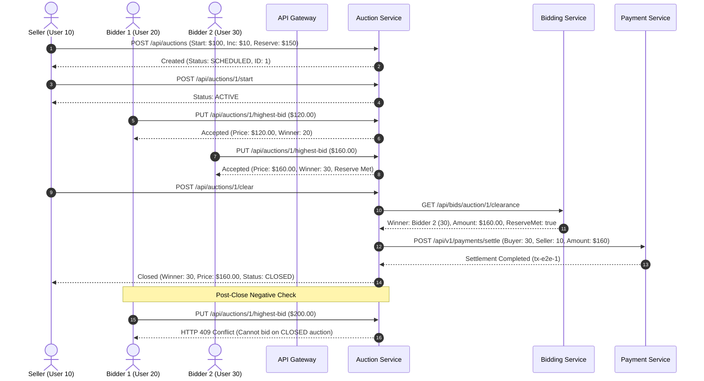

# PS025: Complete Testing & Validation Report

## 1. Executive Summary

This document provides the test execution report, architectural validation, and verification matrix for the **PS025 Real-Time Distributed Bidding & Auction Clearance Engine**. The test suite covers the complete testing pyramid across all 7 reactor modules:
- **Unit Tests**: Isolated domain logic, validations, state transitions, and exception boundaries.
- **Integration Tests**: Full end-to-end auction lifecycle across service boundaries.
- **Security Tests**: Cryptographic JWT validation, token expiration, tampered tokens, unauthenticated access rejection, role-based authorization, and header spoofing defenses.
- **Concurrency & Stress Tests**: Multi-threaded execution testing 2, 10, and 50+ simultaneous bids, identical bid amount races, bid vs. auction close race conditions, and concurrent idempotent payment executions.

---

## 2. Test Execution Summary

The full Maven reactor test suite was executed via:
```bash
mvn clean test
```

### Reactor Test Execution Matrix

| Module | Purpose | Tests Run | Failures | Errors | Skipped | Status | Time |
| :--- | :--- | :---: | :---: | :---: | :---: | :---: | :---: |
| **distributed-auction-engine** | Root Aggregator / BOM | 0 | 0 | 0 | 0 | `SUCCESS` | 0.21s |
| **eureka-server** | Service Discovery & Registry | 1 | 0 | 0 | 0 | `SUCCESS` | 14.53s |
| **api-gateway** | Reactive Edge & Security Filter | 6 | 0 | 0 | 0 | `SUCCESS` | 13.78s |
| **auth-service** | JWT & User Management | 24 | 0 | 0 | 0 | `SUCCESS` | 18.17s |
| **auction-service** | Auction Lifecycle & State Machine | 23 | 0 | 0 | 0 | `SUCCESS` | 31.19s |
| **bidding-service** | Clearance Engine & Bidding Core | 31 | 0 | 0 | 0 | `SUCCESS` | 46.67s |
| **payment-service** | Winner Payments & Wallet Settlement | 32 | 0 | 0 | 0 | `SUCCESS` | 46.63s |
| **TOTAL** | **Full PS025 Ecosystem** | **117** | **0** | **0** | **0** | `SUCCESS` | **2m 51s** |

---

## 3. Unit Testing Matrix

### 3.1 Auth Service (`auth-service`)
- **Registration**: Successfully registers new users with BCrypt password encryption (`AuthServiceImplTest.testRegisterSuccess`).
- **Duplicate User**: Enforces uniqueness on email and username (`AuthServiceImplTest.testRegisterDuplicateEmail`, `testRegisterDuplicateUsername`).
- **Login**: Validates credentials and returns signed JWT token with userId and role (`AuthServiceImplTest.testLoginSuccess`).
- **Invalid Credentials**: Rejects non-existent users and mismatched passwords with HTTP 401 (`AuthServiceImplTest.testLoginPasswordMismatch`, `testLoginUserNotFound`).

### 3.2 Auction Service (`auction-service`)
- **Creation**: Validates required fields, starting price > 0, minimum increment > 0, and valid future time range (`AuctionServiceImplTest.testCreateAuctionSuccess`, `testCreateAuctionInvalidStartingPrice`).
- **Validation**: Rejects invalid start/end times (`testCreateAuctionInvalidTimeRange`) and negative increments (`testCreateAuctionInvalidMinimumIncrement`).
- **Lifecycle**: Full state progression verified: `SCHEDULED` → `ACTIVE` → `CLOSED` / `CANCELLED` (`testStartAuctionSuccess`, `testCancelAuctionSuccessBySeller`).
- **Closure**: Idempotent closure and automated winning bid calculation (`testCloseAuctionSuccess`).

### 3.3 Bidding Service (`bidding-service`)
- **Valid Bid**: Bids meeting or exceeding starting price/minimum increment are accepted and persisted (`BiddingServiceImplTest.testPlaceBidSuccess`).
- **Invalid Bid**: Non-existent auctions or non-positive bids are rejected (`testPlaceBidAuctionNotFound`).
- **Minimum Increment**: Sub-threshold bids below `currentPrice + minIncrement` are rejected with `SubThresholdBidException` (`testPlaceBidSubThresholdAmount`).
- **Seller Restriction**: Sellers are strictly prohibited from bidding on their own auctions (`testPlaceBidSellerCannotBid`).
- **Closed Auction**: Bids placed on `CLOSED` or expired auctions are rejected with `AuctionNotActiveException` (`testPlaceBidAuctionClosed`, `testPlaceBidExpiredAuction`).
- **Deterministic Clearance**: Ties are deterministically resolved using **Price-Time Priority** (earlier timestamp wins for identical highest bid amounts).

### 3.4 Payment Service (`payment-service`)
- **Success**: Authenticated winner successfully completes payment with unique reference (`PaymentWinnerTest.testProcessWinnerPaymentSuccess`).
- **Failure Handling**: Payment provider rejection (e.g. card declined) safely records `FAILED` status and returns clean error message without throwing unhandled exceptions (`testProcessWinnerPaymentFailureHandled`).
- **Duplicate Payment**: Multiple payment calls for an already paid auction return the existing transaction reference with idempotent `SUCCESS` (`testProcessWinnerPaymentIdempotent`).
- **Idempotency & Wallet Settlement**: Clearance settlement between buyer and seller handles concurrent retries cleanly without duplicate deductions (`PaymentServiceImplTest.testSettlePaymentIdempotent`).

---

## 4. End-to-End Integration Testing

Implemented in `EndToEndLifecycleIntegrationTest.java` in `auction-service`:



---

## 5. Security & RBAC Testing Matrix

| Security Scenario | Tested In | Expected Result | Verified Status |
| :--- | :--- | :--- | :---: |
| **Missing JWT Header** | `api-gateway`, `bidding-service`, `auction-service` | HTTP 401 / 403 Forbidden | `PASS` |
| **Invalid JWT Signature** | `bidding-service`, `api-gateway`, `auth-service` | HTTP 401 / 403 Forbidden | `PASS` |
| **Expired JWT Token** | `bidding-service`, `auth-service` | HTTP 401 / 403 Forbidden | `PASS` |
| **Unauthorized User Modifying Auction** | `auction-service` (`AuctionSecurityTest`) | HTTP 403 Forbidden | `PASS` |
| **Unauthenticated Auction Modification** | `auction-service` (`AuctionSecurityTest`) | HTTP 403 Forbidden | `PASS` |
| **Bidder Identity Manipulation via Body** | `bidding-service` (`PlaceBidRequest`) | Body `bidderId` ignored; JWT claims enforced | `PASS` |
| **Unauthorized Payment Details Access** | `payment-service` (`PaymentSecurityTest`) | HTTP 403 Forbidden | `PASS` |
| **Unauthorized Wallet Balance Inspection** | `payment-service` (`PaymentSecurityTest`) | HTTP 403 Forbidden | `PASS` |
| **Client-Supplied Header Spoofing** | `api-gateway` (`AuthenticationFilterTest`) | Untrusted `X-User-*` headers stripped | `PASS` |

---

## 6. Concurrency & Race Condition Testing Matrix

### 6.1 Bidding Service Concurrency (`BiddingConcurrencyTest`)
1. **2 Simultaneous Bids**:
   - Two threads submit $120.00 and $150.00 simultaneously.
   - Result: Exactly $150.00 is recorded as the highest bid; zero race condition.
2. **10 Simultaneous Bids**:
   - 10 threads submit bids from $110.00 to $200.00 simultaneously.
   - Result: Monotonically increasing state; highest bid = $200.00; winning bidder = 110L.
3. **50+ Simultaneous Bids**:
   - 50 concurrent threads submit bids from $105.00 to $350.00 simultaneously.
   - Result: Invariant held; zero lost updates; highest accepted bid in DB matches `AuctionBidState` ($350.00, bidder 550L).
4. **Identical Bid Amount Race**:
   - 5 threads submit identical $150.00 bids simultaneously.
   - Result: Exactly 1 thread succeeds; remaining 4 rejected with `SubThresholdBidException`.
5. **Bid vs. Auction Close Race Condition**:
   - 10 bidding threads compete concurrently while another thread closes the auction.
   - Result: Bids arriving after the close transition are rejected with `AuctionNotActiveException`; clearance deterministic; subsequent post-close bids rejected.

### 6.2 Payment Service Concurrency (`PaymentConcurrencyTest`)
- **10 Simultaneous Payment Requests**:
  - 10 threads concurrently invoke `processWinnerPayment` for auction 99.
  - Result: Mutex locks ensure only **1 underlying payment processor transaction** is executed; all 10 threads receive HTTP `SUCCESS` with the exact same transaction reference; database contains exactly 1 payment record.

---

## 7. Concurrency & Reliability Guarantees Summary

| Guarantee | Mechanism | Verified |
| :--- | :--- | :---: |
| **No Lost Updates** | Per-auction mutex locking (`ConcurrentHashMap<Long, ReentrantLock>`) & Spring transaction boundaries | `YES` |
| **No Duplicate Winners** | Atomic state updates; clearance locks auction and records exactly 1 winner | `YES` |
| **Correct Highest Bid** | Bid threshold checked under lock; DB records match in-memory state | `YES` |
| **Deterministic Winner** | Price-Time priority ordering: `ORDER BY amount DESC, acceptedAt ASC` | `YES` |
| **No Post-Close Bids** | Status verified under lock; closed auctions immediately reject bids | `YES` |
| **Exactly One Successful Payment** | Mutex serialization + payment idempotency checking prior to processing | `YES` |

---

## 8. Reproduction Instructions

To execute the entire test suite locally:
```bash
# Clean and test all services
mvn clean test

# Run specific service tests
mvn test -pl bidding-service
mvn test -pl payment-service
mvn test -pl auction-service
mvn test -pl auth-service
mvn test -pl api-gateway
```
